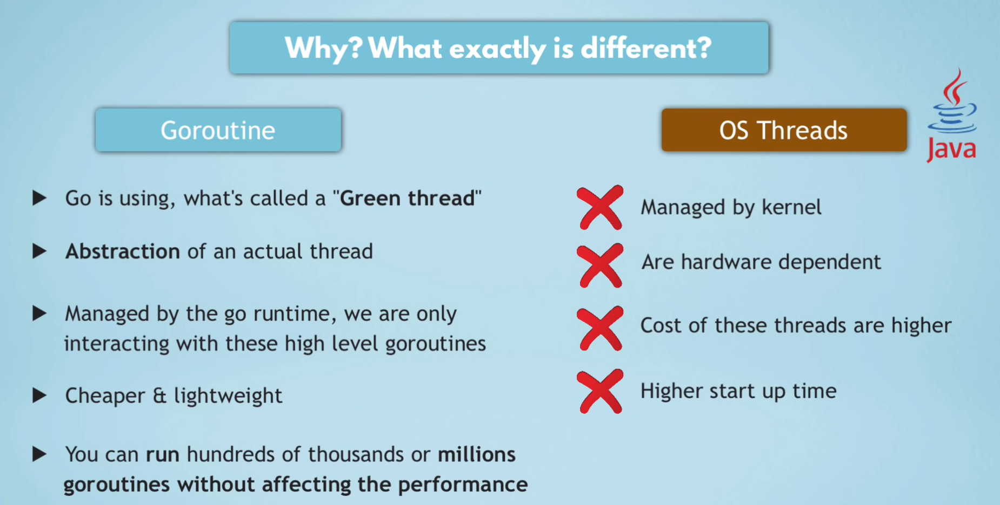
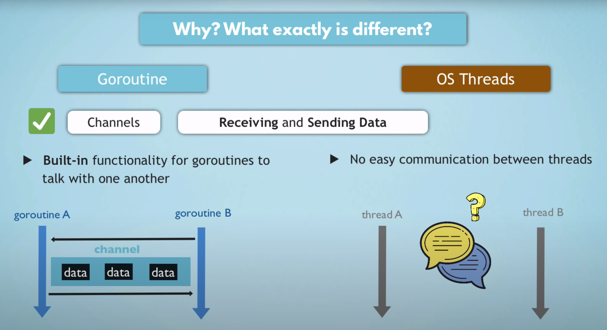

# lets-golang

### Concepts:
- Go was designed to run on multiple cores and built to support concurrency
- Concurrency in Go is cheap and easy

### Main Use Case of Go
- For Performant Applications
- Running on scaled, distributed systems (typically on cloud platform)

## Go Packages
- Go programs are organized into packages
- Go's standard lib, provides different core packages to use
- "fmt" is one of these, can use by importing it

## Note
- có thể khai bảo sử dụng ":=" áp dụng đối với variable, không áp dụng với constant, và không làm được việc chỉ rõ ra kiểu dữ liệu mong muốn (vd: var ticket uint = 30)

### Arrays
#### Declare

```
bookings = [50]string{}

bookings = [50]string{"Nam", "Bac"}

bookings [50]string

len(bookings)
```

### Slices
#### Declare

```
var users []string

users = append(users, "admin")
```

### Loops
```
    basic loop
    for i := 0; i < 10; i++ {
        fmt.Println(i)
    }
```
```
    // For-each
    nums := []int{2, 4, 6, 8, 10}
    for index, value := range nums {
        fmt.Printf("Index: %d, Value: %d\n", index, value)
    }
```
```
    // Condition loop
    i := 0
    for i < 10 {
        fmt.Println(i)
        i++
    }
```
```
    // Infinity loop
    i := 0
    for {
        if i >= 10 {
            break
        }
        fmt.Println(i)
        i++
    }
```

### Conditions
```
    x := 7
    if x > 10 {
        fmt.Println("x is greater than 10")
    } else if x > 5 {
        fmt.Println("x is greater than 5 but less than or equal to 10")
    } else {
        fmt.Println("x is 5 or less")
    }
```

### Functions

```
func functionName(parameters) returnType {
    // function body
}
```

```
// Function with no returns
func greet() {
    fmt.Println("Hello, World!")
}
```

```
// Function has parametes
func greet(name string) {
    fmt.Println("Hello,", name)
}
```

```
// Function has returns
func add(a int, b int) int {
    return a + b
}

func main() {
    sum := add(3, 4)
    fmt.Println("Sum:", sum)
}
```
```
// Function has multiple returns
func swap(a, b int) (int, int) {
    return b, a
}

func main() {
    x, y := swap(1, 2)
    fmt.Println("Swapped values:", x, y)
}
```

```
pass a pointer

func multiple(x *int) {
	*x = *x * 2
}

func main() {
	x := 2
	multiple(&x)
	fmt.Print(x)
}

```

### Go Packages

Có thể tạo ra các package khác nhau bằng cách tạo 1 folder chứa, tên package là tên folder

Để import được function viêt trong 1 package khác:

- import project-name/package-name
- function muốn sử dụng cần phải được export, trong Golang, để export function thì chỉ cần viết hoa chữ cái đầu của tên hàm (ví dụ Print())

### Scope rules

- Local

- Package

```
// Có thể truy cập bên trong package
var tickets = 50
```

- Global
```
// Có thể truy cập Global
var Tickets = 50 // Viết hoa chữ cái đầu
```

### Maps
- Maps unique keys to values
- Can retrive the value by using its key later

- Create a map
```
var myMap = make(map[string]string)
```

- Create a list of map
```
var myMaps = make([]map[string]string, 0)
```

### Struct
- lightweight of class
```
type User struct {
	firstName string
	lastName  string
	age       uint
}
```
### Concurrency - Goroutines
- Tạo ra 1 thread mới thực thi tác vụ tốn thời gian
- Thực hiện bằng cách thêm keyword "go" vào trước lời gọi thực thi function

### Synchonize
- Khi main thread kết thúc nó sẽ ignore tất cả những thread khác (kể cả chưa bắt đầu hay chưa kết thúc)

- Để giải quyết, sử dụng WaitGroup

- Khởi tạo

```
    var wg = sync.WaitGroup{}
```

- Add

Tăng bộ đếm số lượng thread cần phải chờ

```
func main(){
    wg.Add(1) // có 1 thread cần chờ
    go sendTicket() // tác vụ tốn thời gian
    wg.Wait()
}
func sendTicket(){
    time.Sleep(100 * time.Second)
    wg.Done()
}

```

Compare với Java sử dụng Thread của OS




